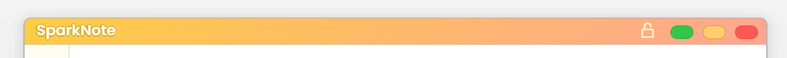
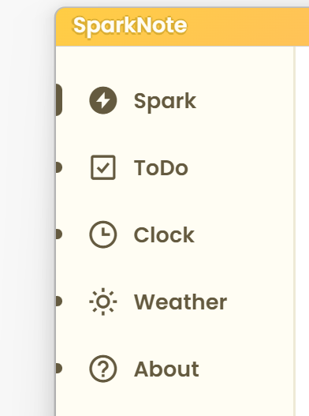
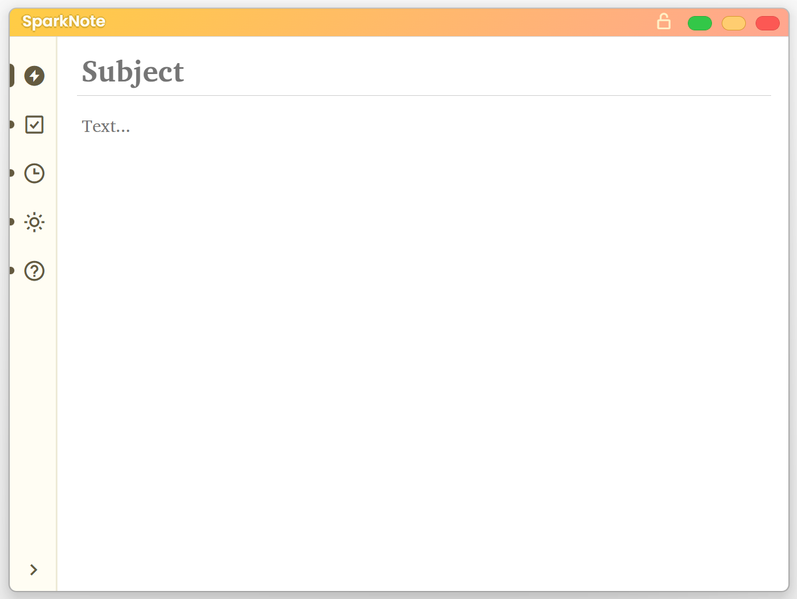
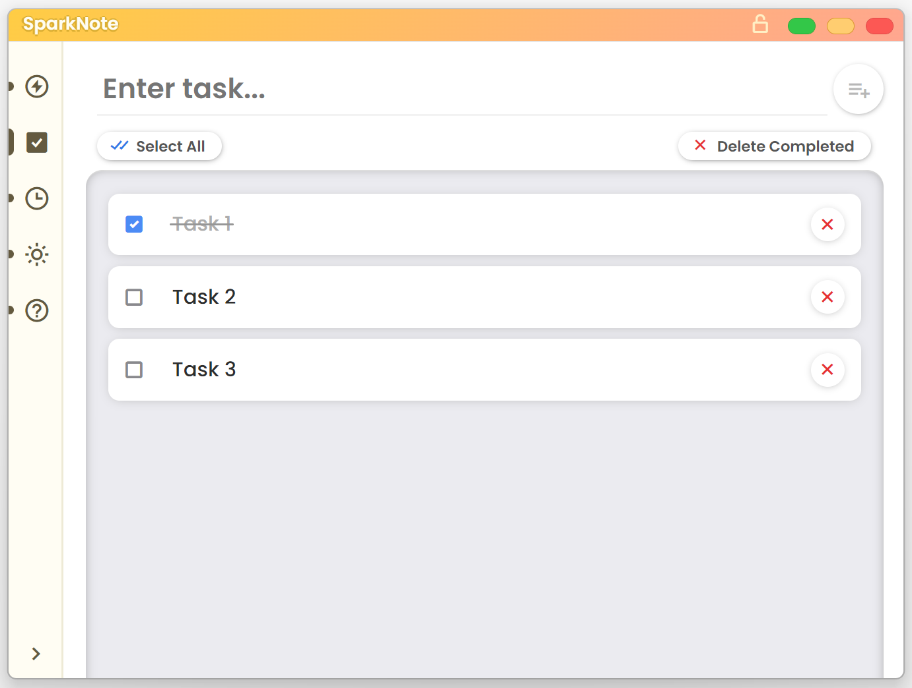
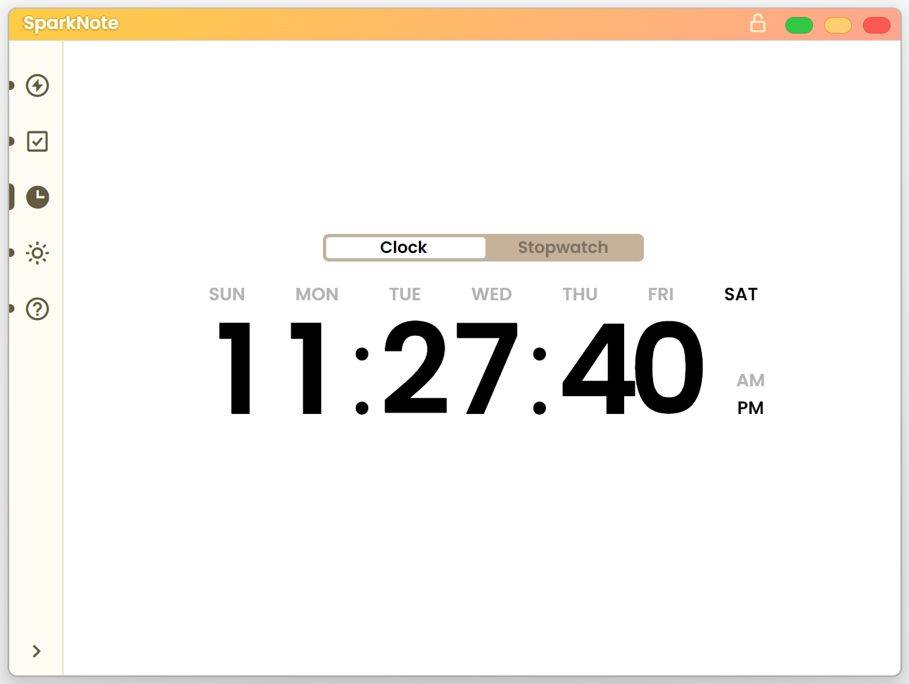
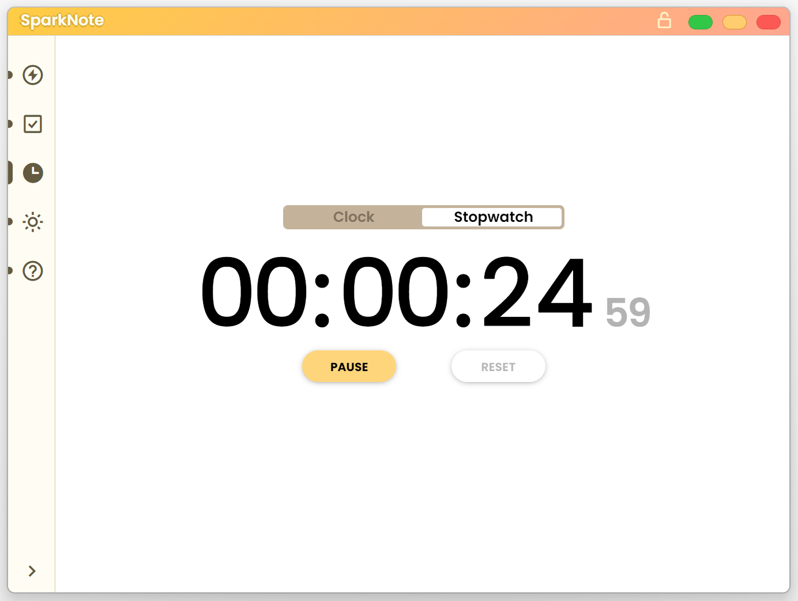
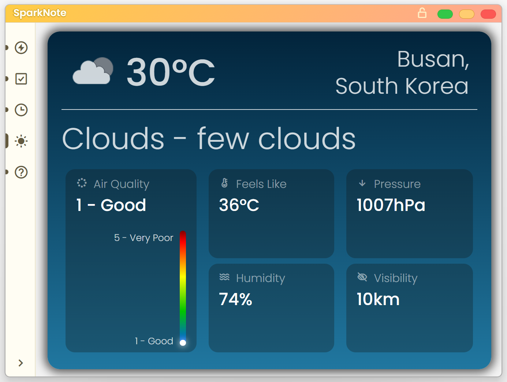
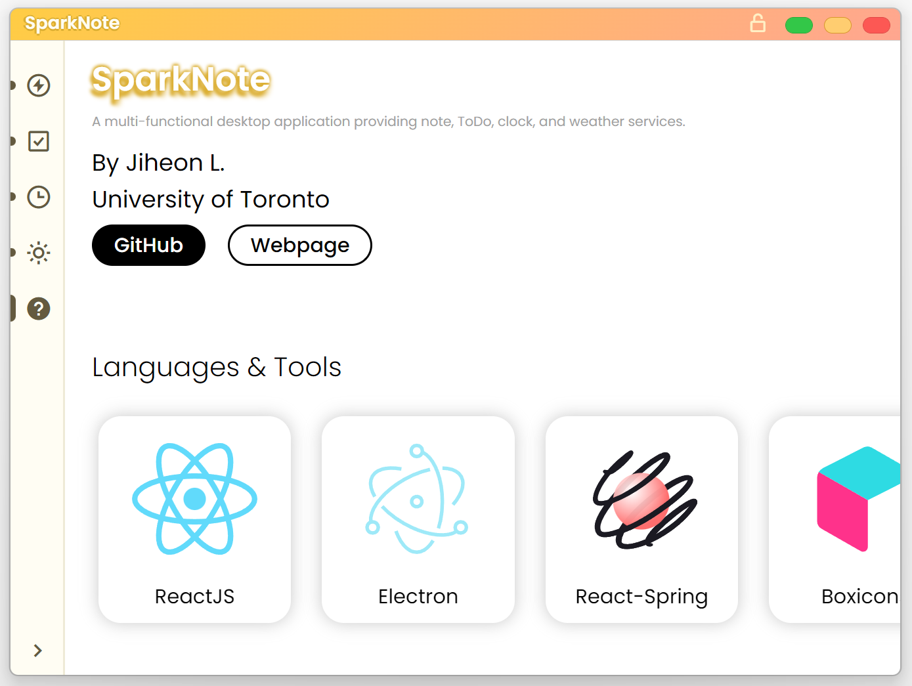

# SparkNote

## Description

A one-month project for developing a multi-functional desktop application including note, todo, clock, and weather.

## UI

### 1. Title Bar

- On Top: Allows the window to always stay on the top of other windows.
- Traffic-style bar buttons: maximize (restore), minimize, and close buttons.

### 2. Navigation

- A navigation bar through which users can explore various functions. It can also be folded to a list of icons.

 
 

---

## Functionalities

### 1. Spark

- A simple notepad that you can scratch your idea quickly.

### 2. ToDo List

- A classic ToDo list.

### 3-1. Clock

- A clock with day and am/pm.

### 3-2. Stopwatch

- A stopwatch.

### 4. Weather

- A weather from [OpenWeatherMap](https://openweathermap.org/) API.

### 5. About

- General information about this application.
